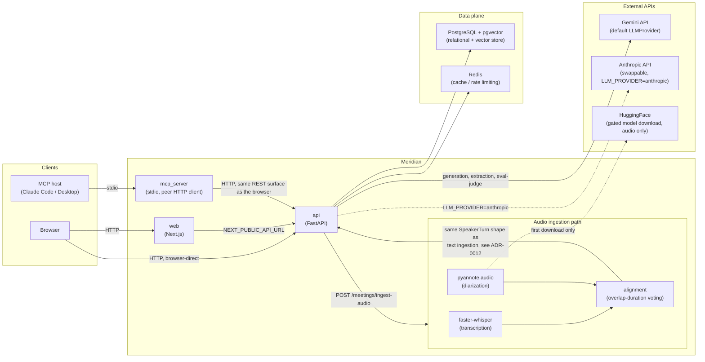

[](https://github.com/Sa-Te/meridian/actions/workflows/ci.yml)

# Meridian

Meridian is a meeting intelligence system that ingests speaker-labelled,
timestamped meeting transcripts — from text or from real audio, with
genuine speaker diarization — from a simulated health-tech consulting
engagement, and answers questions about discussions, decisions, and
action items using retrieval-augmented generation.

Built as the take-home assignment for a Forward Deployed Engineer role at
Newpage Solutions. `CLAUDE.md` is the engineering contract this project
was built against; `ROADMAP.md` is the phased build plan; `docs/adr/`
holds every architecture decision this README summarizes, with full
context and the alternatives that were rejected — see `docs/adr/README.md`
for an index.

> **A note on this document.** This README was drafted with AI
> assistance (see Section 7) and reviewed, corrected, and rewritten in my
> own words before submission. Sections 4 through 8 in particular reflect
> my own understanding and judgment, not an LLM's unedited output — see
> Section 7 for exactly how that worked.

---

## Table of contents

1. [Quick setup](#1-quick-setup)
2. [Architecture overview](#2-architecture-overview)
3. [Productionizing this](#3-productionizing-this)
4. [RAG/LLM approach and decisions](#4-ragllm-approach-and-decisions)
5. [Key technical decisions and why](#5-key-technical-decisions-and-why)
6. [Engineering standards followed, and what was consciously skipped](#6-engineering-standards-followed-and-what-was-consciously-skipped)
7. [How AI coding tools were used](#7-how-ai-coding-tools-were-used)
8. [What I'd do differently with more time](#8-what-id-do-differently-with-more-time)
9. [Screenshots](#9-screenshots)

---

## 1. Quick setup

Requirements: Docker and Docker Compose. Nothing else — no local Python,
Node, or Postgres install needed.

```bash
git clone <this-repo>
cd meridian
cp .env.example .env
```

Open `.env` and set exactly one required value:

```bash
GEMINI_API_KEY=your-key-here
```

Get a free key from [Google AI Studio](https://aistudio.google.com/) —
no billing account required. Every other value in `.env.example` already
has a working default (see `docs/adr/0004` and `docs/adr/0013` for why
Gemini + a local embedding model is the only combination that needs a
real key at all).

```bash
docker compose up
```

This brings up four services: `postgres` (with `pgvector`), `redis`,
`api` (FastAPI), and `web` (Next.js). First boot is slower than
subsequent ones — the local embedding model (`BAAI/bge-base-en-v1.5`,
~440MB) downloads once and is cached in a named volume after that.

- Web app: [http://localhost:3000](http://localhost:3000)
- API docs (FastAPI's own OpenAPI UI): [http://localhost:8000/docs](http://localhost:8000/docs)

### Optional: audio ingestion

`POST /meetings/ingest-audio` (real transcription + real speaker
diarization, see `docs/adr/0012`) needs one more credential, only if
you want to use it:

```bash
HF_TOKEN=your-huggingface-token-here
```

Get a free HuggingFace account, accept the gated model terms on
[pyannote/segmentation-3.0](https://huggingface.co/pyannote/segmentation-3.0),
[pyannote/speaker-diarization-3.1](https://huggingface.co/pyannote/speaker-diarization-3.1),
and [pyannote/speaker-diarization-community-1](https://huggingface.co/pyannote/speaker-diarization-community-1)
(all one-click acceptances, not a review queue — see `docs/adr/0012`'s
notes on why there are three), then generate a read-scoped token under
account settings. Without `HF_TOKEN`, every other feature works
unaffected; only the audio endpoint returns a clear error naming what's
missing.

### Optional: MCP server

`apps/mcp_server/` exposes `search_meetings`/`ask_meetings`/
`get_action_items` as MCP tools, so Claude Code or Claude Desktop can
query past meetings directly (`docs/adr/0011`). It's a separate, optional
local process — a thin stdio-to-HTTP client of the already-running `api`
service, not part of `docker compose up`.

```bash
cd apps/mcp_server
python3 -m venv .venv
.venv/bin/pip install -e .
```

The repo's `.mcp.json` already points Claude Code at
`apps/mcp_server/.venv/bin/python -m mcp_server`, so once the venv above
exists, restarting Claude Code in this repo (or pointing Claude Desktop's
own MCP config at the same command) is enough to connect it. Confirm three
tools are listed — `search_meetings`, `ask_meetings`, `get_action_items` —
each a direct HTTP call to the same `api` endpoints the web app uses, with
no retrieval/generation/extraction logic duplicated in the MCP server
itself.

### Running the test suite / eval gate yourself

```bash
cd apps/api && pip install -e ".[dev]" && pytest
cd apps/web && npm ci && npm run test:ci
```

The eval-suite quality gate (`docs/adr/0009`, `docs/adr/0016`) spends
real Gemini API calls and only runs in CI on pushes to `main` or manual
dispatch, not on every push — see `.github/workflows/eval.yml`. Run it
locally with `python -m eval.run_eval` from `apps/api` if you want to see
it for yourself; it takes a few minutes on a free-tier key.

---

## 2. Architecture overview



**Reading this diagram:** `web` and the browser both talk to `api`
directly — `web`'s own client-side JavaScript calls the API over
`NEXT_PUBLIC_API_URL` (see `docs/adr/0014`), it isn't proxied through a
Next.js server route. `mcp_server` is a _peer_ of `web`, not a
sub-component of `api`: it's a separate process, speaking the same REST
surface over plain HTTP, with zero retrieval/generation logic of its own
(`docs/adr/0011`). The audio ingestion path (`docs/adr/0012`) is a
different front door onto the _same_ downstream pipeline text ingestion
already uses — transcription and diarization only produce
speaker-labelled turns; chunking, embedding, storage, extraction, and
guardrails run completely unmodified either way.

**Why Gemini, not Anthropic, is the solid line to the LLM.** ADR-0002
originally chose Anthropic Claude as the default `LLMProvider`; ADR-0013
switched the _default_ to Gemini for cost reasons (a genuinely free tier,
versus a paid-after-trial-credit Anthropic key) without removing the
Anthropic implementation — it's still a real, working, tested second
adapter behind the same interface, just not what a fresh `docker compose
up` uses. The diagram shows that as the dotted "swappable" line it
actually is today, not the ADR-0002-era default the original ROADMAP text
for this diagram assumed.

### Request-flow summary

- **`POST /ask` / `POST /meetings/{id}/ask`**: embed the question ->
  hybrid search (pgvector cosine + Postgres full-text, fused) -> a
  confidence guardrail that can decline before spending an LLM call ->
  Gemini generates a cited answer -> citations are guardrail-checked
  against what was actually retrieved before being trusted.
- **`POST /meetings/ingest`**: parse -> speaker-turn-aware chunk -> embed
  -> store -> prompt-injection scan (flags, doesn't block) -> Gemini
  structured extraction (decisions/action items, each guardrail-checked
  per item) -> persist.
- **`POST /meetings/ingest-audio`**: decode audio once -> faster-whisper
  transcription and pyannote.audio diarization run concurrently over the
  same waveform -> align into speaker-labelled turns (an honest "Unknown
  Speaker" for anything the overlap data doesn't clearly support) ->
  the _same_ chunk -> embed -> store -> extract pipeline as above.
- Every request above is traced (`docs/adr/0010`): stage-by-stage
  timings, token usage, and outcome, queryable via `GET /traces`.

---

## 3. Productionizing this

This section is deliberately specific about what's real versus what's a
sketch — see `infra/terraform/README.md` for the fuller version of this
same honesty applied to the Terraform files themselves.

### What's real today

- A fully working, tested, containerized system: every service in the
  architecture diagram above runs, is unit/integration tested (99%
  branch coverage on the backend's business logic — `docs/adr/0015`),
  and passes a genuine CI quality gate before merge (`docs/adr/0009`,
  `docs/adr/0016`).
- The `EmbeddingProvider`/`LLMProvider`/`TranscriptionProvider`/
  `DiarizationProvider` interfaces (`docs/adr/0002`, `docs/adr/0003`,
  `docs/adr/0012`) — vendor swaps are a config change, proven by actually
  having two working `LLMProvider` implementations and two working
  `EmbeddingProvider` implementations, not just an interface nobody
  exercises.

### What's a sketch, not a deployment

`infra/terraform/` is real, `terraform validate`-clean Terraform HCL
describing an ECS Fargate + RDS (pgvector) + ElastiCache + ALB + S3
architecture — but it has never been applied against a real AWS account,
has no state backend configured, and creates no secrets (it reads
externally-provisioned Secrets Manager ARNs, and never invents a
placeholder credential of its own). It exists so "how would you deploy
this" has a reviewable, concrete answer instead of only a paragraph of
prose. What it deliberately leaves out — autoscaling policies, CloudWatch
alarms, WAF, multi-AZ RDS failover, a CI gate that runs `terraform plan`
on PRs — is listed explicitly in `infra/terraform/README.md`, because
sizing any of those needs real traffic data this project has none of.

### The pgvector -> dedicated vector database trigger

ADR-0004 names the concrete condition for revisiting `pgvector`-in-Postgres:
**corpus size past roughly a few million chunks, or a real need for
per-tenant vector-index isolation.** Below that, a dedicated vector
database (Qdrant, Pinecone, Weaviate) is an extra moving part with no job
to do yet — this demo's entire transcript corpus chunks into low hundreds
of rows. Past that trigger, the concrete reasons are: pgvector's HNSW/
IVFFlat index build and query-time trade-offs start losing to a
purpose-built ANN index at real scale, and a multi-tenant deployment
(see below) benefits from per-tenant index/collection isolation a single
shared Postgres instance doesn't give you for free. The `EmbeddingProvider`/
retrieval-layer boundary (`docs/adr/0007`) means this swap touches
`ChunkRepository`'s two query methods and nothing else — `hybrid_search`,
`fuse_scores`, and everything downstream of retrieval stay unchanged.

### Auth and multi-tenancy: an explicit, current gap

There is **no authentication or authorization anywhere in this system** —
not on the REST API, not on the MCP server (`docs/adr/0011` names this
explicitly), not between services. This is a deliberate non-goal for
this submission (CLAUDE.md Section 9: "a single-user local/dev experience
is enough"), not an oversight discovered late. A real multi-tenant
deployment would need, at minimum: a real identity provider (Cognito,
Auth0, or a hand-rolled OAuth2 flow) in front of both `api` and any
Streamable-HTTP MCP transport, a `tenant_id` (or `organization_id`)
column on `Meeting` and every row that hangs off it, row-level security
or a query-layer filter enforced on _every_ repository method (not just
the new ones — retrofitting this is real, error-prone surgery on
`ChunkRepository`'s cross-meeting global search in particular), and
per-tenant rate limiting on the LLM/embedding call paths so one tenant's
usage can't starve another's. None of this exists today; the README says
so rather than the gap being discovered by a reviewer poking at the API.

### Other real gaps worth naming here

- **No PII/PHI redaction** (`docs/adr/0008`) — acceptable because this
  dataset is synthetic and health-_adjacent_, not real patient data; a
  blocking prerequisite for any real clinical deployment.
- **Compressed audio formats** (mp3/m4a) aren't accepted by
  `POST /meetings/ingest-audio` — only `.wav`/`.flac` (`docs/adr/0012`).
- **Offset-based pagination** on `GET /traces` — fine at today's volume,
  not at real production trace volume (`docs/adr/0010`).

---

## 4. RAG/LLM approach and decisions

The core loop is: **hybrid retrieval, fused simply and explainably, over
citation-enforced generation** — deliberately not a framework, and
deliberately not the fanciest version of any individual piece.

**Tech stack (ADR-0002).** FastAPI + Python across the backend, Next.js +
TypeScript across the frontend, PostgreSQL doing double duty as both the
relational store and (via the `pgvector` extension) the vector store,
Redis for caching. One database instance instead of a database plus a
separate vector database plus a separate document store — each of those
extra moving parts was considered and rejected for having no real job to
do at this project's scale (see Section 3 for exactly when that changes).

**No orchestration framework (ADR-0003).** No LangChain, no LlamaIndex,
for the same reason CLAUDE.md forbids "framework magic without
justification": every retrieval and generation step is code I can read
start to finish and explain live, not a chain abstraction I'd have to
explain by pointing at documentation. This cost more hand-written code
(every stage — chunk, embed, store, retrieve, rank, prompt, generate,
extract, guard — is its own small, independently-tested function) in
exchange for total transparency and much easier custom tracing
instrumentation (`docs/adr/0010`), which a framework's own abstractions
would have made harder to attach without fighting them.

**Storage and embeddings (ADR-0004).** `pgvector` inside the already-
required Postgres instance, not a dedicated vector database — see
Section 3 for the scaling trigger. Embeddings default to a local,
open-source model (`BAAI/bge-base-en-v1.5`) run inside the API container,
specifically so the _entire system_ runs end-to-end on one external
credential (`GEMINI_API_KEY`) — no reviewer needs a second paid API key
just to clone this and see it work. Voyage AI and OpenAI embeddings are
implemented as a one-environment-variable swap behind the same
`EmbeddingProvider` interface for anyone who wants higher-recall
production embeddings instead.

**Chunking (ADR-0006).** Speaker-turn-aware, not fixed-size. Consecutive
turns from the same speaker merge into one chunk (up to a 220-word
budget); a turn never splits across a chunk boundary unless it alone
exceeds that budget, in which case it splits along sentence boundaries,
never mid-sentence. The alternative — chopping every N words regardless
of who's speaking — is simpler but routinely cuts a sentence, or an
entire point someone was making, in half across two retrieved chunks,
which is a worse citation than one that starts and ends on a real
conversational boundary.

**Retrieval and citation (ADR-0007).** Two independent signals — pgvector
cosine similarity and Postgres full-text search (`ts_rank` over a
generated `tsvector` column) — are each min-max normalized to `[0, 1]`
and combined as a simple weighted sum (`0.6` vector, `0.4` text; both
configurable), rather than a cross-encoder re-ranker. This was a
deliberate, named trade-off: a re-ranker would likely rank better on
paraphrased questions, at the cost of a second model call per query, and
the assignment specifically asked for reasoning about _not_ building the
fanciest version. Generation asks the LLM for a single JSON object
naming which chunk it drew each claim from; every cited `chunk_id` is
checked against the set of chunks that were _actually retrieved_ for
that question before the answer is trusted — a hallucinated or
out-of-scope citation fails validation, triggers one retry with a
stricter prompt, and falls back to an honest "I could not find a
well-supported answer" rather than either an error or a fabrication.

**Beyond plain Q&A**, the same citation-enforcement machinery generalizes
to structured extraction (ADR-0008): every ingested meeting is
automatically scanned for decisions and action items via the LLM's native
structured-output mode, each one guardrail-checked individually (a bad
citation drops only that one item, not the whole batch) and dropped
below a confidence threshold rather than recorded as fact.

---

## 5. Key technical decisions and why

Full context, rejected alternatives, and consequences for every decision
below live in `docs/adr/` — see `docs/adr/README.md` for the index. This
is the condensed version.

| #    | Decision                                                                                                  | Why                                                                                                                                                                                       |
| ---- | --------------------------------------------------------------------------------------------------------- | ----------------------------------------------------------------------------------------------------------------------------------------------------------------------------------------- |
| 0001 | Built "Meeting Intelligence," framed as a health-tech consulting engagement                               | Weakest overlap with the safest default choice (plain doc-Q&A) and with my own prior personal projects; strongest fit for an FDE role's business-facing, stakeholder-embedded framing     |
| 0002 | FastAPI/Next.js/Postgres+pgvector/Redis stack                                                             | Matches the target JD's named stack line for line; one Postgres instance instead of three separate storage systems with no real job to do yet                                             |
| 0003 | Hand-written orchestration, no LangChain/LlamaIndex                                                       | Full transparency and easier custom tracing; more code written by hand in exchange                                                                                                        |
| 0004 | Local BGE embeddings + pgvector, both swappable                                                           | Only `GEMINI_API_KEY` required end-to-end; Voyage/OpenAI and a dedicated vector DB are both one-config-change upgrades with a named scaling trigger                                       |
| 0005 | UUID PKs, DB-level confidence/citation constraints, `ON DELETE CASCADE`                                   | A `Decision`/`ActionItem` can never outlive its citation, enforced by the database itself, not application code discipline                                                                |
| 0006 | Speaker-turn-aware chunking, word-count token proxy                                                       | Never splits a point mid-sentence or mid-speaker; word count is a model-agnostic, dependency-free proxy accepted as an approximation                                                      |
| 0007 | Hybrid retrieval (vector + full-text), weighted-sum fusion, citation guardrail                            | Explainable, tunable, and the assignment explicitly asked for "a simple weighted score" over a cross-encoder                                                                              |
| 0008 | Native structured output for extraction; per-item guardrail filtering; PII redaction explicitly not built | One bad extraction doesn't discard four good ones from the same meeting; redaction would protect nothing against this synthetic dataset while adding real complexity                      |
| 0009 | Retrieval hit-rate + LLM-as-judge faithfulness/relevance, gated in CI                                     | Retrieval metrics alone miss generation bugs; answer-quality metrics alone can't tell "retrieval failed" from "the model got it wrong anyway"                                             |
| 0010 | Tracing via provider decorators + router-level stages, zero lines in business logic                       | The same ports-and-adapters seam that lets a vendor swap without touching business logic also lets instrumentation in for free                                                            |
| 0011 | MCP server as a thin peer HTTP client, no ingestion tool                                                  | The JD names MCP explicitly; every guardrail/ranking decision lives exactly once, in `apps/api`, whichever caller is asking                                                               |
| 0012 | faster-whisper + pyannote.audio, majority-overlap-duration alignment                                      | Real diarization (not hardcoded speaker labels), with explicit, tested policies for overlapping speech, speaker-count mismatch, and short utterances                                      |
| 0013 | Gemini as the default `LLMProvider`, Anthropic kept as a second working implementation                    | A genuinely free tier versus a paid-after-trial-credit key, for a project run iteratively during development — with a real, honestly-accepted self-preference-bias cost on the eval judge |
| 0014 | Hand-rolled glass/neumorphic component library, plain client-side fetch, no generic data-fetching hook    | Matches CLAUDE.md's design language exactly, at less effort than adapting a general-purpose library; a generic hook couldn't satisfy this toolchain's strict hook-dependency lint rule    |
| 0015 | Coverage tooling, a real `coverage.py`/greenlet fix, fail-fast CI ordering                                | A misconfigured coverage tool was reporting untested code that was actually fully tested — found and fixed before writing a single new test                                               |
| 0016 | Eval-suite gate moved off the per-push pipeline; an in-process eval-run cache                             | The gate's real Gemini cost, previously accepted per-push, actually exhausted a free-tier daily quota once "per push" meant "every commit on every branch"                                |

---

## 6. Engineering standards followed, and what was consciously skipped

**Followed, throughout:**

- Every module ships with real unit (and, where it touches the database,
  integration) tests in the same change that introduces it — not
  100% coverage of trivial getters, but no untested branch in chunking,
  retrieval fusion, extraction, or guardrail logic (verified directly,
  see `docs/adr/0015`).
- Ports-and-adapters for anything that might change vendors — proven, not
  just declared: two working `LLMProvider` implementations, two working
  `EmbeddingProvider` implementations, and the same pattern extended
  cleanly to audio transcription/diarization in `docs/adr/0012`.
- No framework magic without a written justification — `docs/adr/0003`
  for the backend, `docs/adr/0014` for the frontend.
- Every non-trivial decision has an ADR, written before or immediately
  after the code that implements it, including the ones that turned out
  to be revisions of earlier decisions (`docs/adr/0013` amends `0002`;
  `docs/adr/0016` amends part of `0015`) rather than silently overwriting
  history.
- CI fails fast (lint -> type-check -> unit -> integration -> build) on
  every push, with the expensive real-model quality gate isolated to
  merges to `main` and manual dispatch, not every commit.

**Consciously skipped** (CLAUDE.md Section 9's explicit non-goals, not
things discovered missing after the fact):

- **No multi-tenant auth system.** A single-user local/dev experience is
  the stated scope; see Section 3 for what a real one would need.
- **No horizontal scaling infrastructure actually stood up.** Terraform
  is a documented sketch (Section 3, `infra/terraform/README.md`), never
  applied.
- **No exhaustive malformed-transcript-format handling.** The parser
  raises a clear, specific error on an unrecognized line rather than
  silently misreading it — acknowledged gaps, not gold-plated parsing.
- **Voice-to-transcript was sequenced after testing/CI hardening, on
  purpose**, "regardless of how much time is available" — a second
  complex ML pipeline is easier to get right once the pipeline it feeds
  into is stable and tested, not before. It shipped after that hardening
  landed (`docs/adr/0015`, `docs/adr/0016`), not instead of it.
- **Anthropic's `generate_structured` is unimplemented** (`docs/adr/0008`)
  — a real, named gap rather than an untested implementation shipped to
  look complete. `LLM_PROVIDER=anthropic` works for `generate`; it isn't
  a full drop-in for extraction yet.
- **A prompt-injection scanner that's a fixed regex list, not a
  classifier.** It will miss a sufficiently paraphrased attempt — flagged
  as detection, not a guarantee, and it's flagging (visible to a human
  reviewer) rather than silently blocking either way.

---

## 7. How AI coding tools were used

The whole thing was built via instruction, not manual coding, in the sense
that Claude Code performed the implementation after I defined what the
"Done" was for each phase, my roadmap, ADR, testing standards (which live
in `CLAUDE.md`), and tech stack before writing any code. The build was
guided, not opportunistic.

I was there to check things out and guide, not to code. The two things
that proved critical were:

Firstly, every single "done" state was double-checked with a quick browser
and/or API poke. Otherwise, the whole second stage would have sailed right
on past because tests were passing, but the API endpoint that stage
exposed returned 404 because it was pointed at an outdated Docker image
(rather than a code problem) — I only found out by poking it live, not
trusting the test report.

Secondly, consequential decisions weren't just made by the tool. In the
extraction logic, a true fork in approach occurred – should native
vendor-structured-output be parsed (with its myriad of vendor-specific
quirks), or stick with the simpler plain-JSON format which had already
been in use? Claude Code prompted for a decision, rather than making a
choice behind the scenes, and I made that call; furthermore, this decision
was made in favour of only shipping the Gemini path since I had no ability
to verify an Anthropic path with the provided API key (`docs/adr/0008`).
The decision to default to Gemini over Anthropic, as mentioned in my
prompt to use only Gemini, was similarly a real-world decision I made
mid-build in response to the budget — worth being precise here, since it's
a distinction the codebase itself insists on: Anthropic wasn't ripped out,
it's properly still sat in `apps/api/app/providers/llm/anthropic_provider.py`
as a second, genuinely working `LLMProvider` implementation
(`docs/adr/0013`), just demoted from the default a fresh `docker compose
up` reaches for.

I reviewed every element of what was output by the tool against the
principles and plans defined — scope drift, sensitive information being
accidentally leaked, stack consistency, and alignment with our thought
process regarding the tech choices and the architecture, all without
needing to pore through the generated code end-to-end. I will do this full
pass through the code itself before the tech interview, of course.

During this process, I kept an ongoing log in Obsidian – notes from AI
sessions, significant design choices, and a focused debug log to capture
problems as they emerged and the path taken to resolution (including one
Docker build issue traced back to a problem with accessing a Windows
mount from WSL, which I logged along with the cause and the fix). This
log essentially captures how the entire AI-assisted process played out.

---

## 8. What I'd do differently with more time

Some concrete shortcomings revealed during the build, not the "digging for
issues after the fact" ones that the post-build review highlights (e.g.,
the unimplemented Anthropic structured output option, the LLM used for
scoring being the same family as generation, PII/PHI was outside the
scope, even though the problem statement was framed as health data) –
these are intentional trade-offs made under pressure and not errors I
missed. All three are properly documented as deliberate calls at the time,
not things I only noticed in hindsight — the Anthropic gap in
`docs/adr/0008`, the judge's self-preference bias in `docs/adr/0009` and
`docs/adr/0013`, and the PII/PHI scope call in `docs/adr/0008` again.
Fair enough to still want them closed eventually, but they were never
blind spots.

Beyond those, if given more time, my priorities would be:

- **Deeper test coverage** – targeting more edge cases and the
  guardrail/extraction paths using adversarial inputs rather than solely
  focusing on the happy path. `docs/adr/0015` got branch coverage on the
  business logic that exists genuinely high; the gap is adversarial and
  edge-case inputs against that same logic, not untested happy-path code.
- **Close the `df-2` retrieval gap** (`docs/adr/0009`): a genuine, measured
  miss where the answer to a direct-fact question lives in a chunk that's
  a bare number with no restated context, one turn away from the
  question that gives it meaning. A cross-encoder re-ranker over a wider
  candidate pool, or a chunking strategy that keeps a short window of
  surrounding turns for very short chunks, are both plausible fixes —
  neither was in scope for the phase whose job was to measure and report
  the gap, not close it.
- **A larger, better-sourced eval set** (`docs/adr/0009`): hundreds of
  questions per category sourced from real logged queries rather than
  20 hand-written ones, with a held-out slice never used for threshold
  tuning.
- **Expanded UI functionality** – while the core workflows are covered,
  there's considerable room for enhancing the user interface. Concretely,
  two gaps a manual QA pass turned up (see `TESTING.md`): audio ingestion
  has no web UI at all today — only the FastAPI docs page can drive
  `POST /meetings/ingest-audio` — and there's no way anywhere in the
  system, UI or API, to ever mark an action item "in progress" or "done"
  once it's extracted. The status filter's code is correct; it's just
  filtering against data that can never exist yet.
- **Implementing the Terraform** – transforming the document outline into
  live, functional infrastructure as code and verifying the end-to-end
  deployment process, not just describing it.
- **A real production observability stack** (`docs/adr/0010`): structured
  logs shipped to a real aggregator, actual OpenTelemetry instrumentation
  with a real exporter, rolling-aggregate alerting, and a retention policy
  — `traces` grows unboundedly today, fine at demo volume, not at real
  volume.
- **Full-fledged verification against real infrastructure** – the only
  actual execution of this code to date has been within Docker Compose;
  running it in a live environment against real infrastructure would be
  the next step.
- **Grow `useAsyncState` into something every view actually uses.** It
  was built (`docs/adr/0014`) specifically to share the loading/data/error
  shape across views, but a later coverage pass found no component
  actually imports it — every view still hand-rolls the same triple
  itself. A real DRY gap against my own stated engineering standard,
  caught, not yet fixed.

---

## 9. Screenshots

_Placeholders below — TJ to replace with real screenshots of the running
app before submission (CLAUDE.md Section 10 / ROADMAP Phase 11's
definition of done: "Screenshots are real, not placeholders, in the
final version")._

**1. Chat with a citation** — `http://localhost:3000/` (or wherever the
chat view is mounted). Ask a question with a known answer in the seed
transcripts, and capture the response _with its citation chip expanded_,
showing the speaker/timestamp/excerpt inline.

``

**2. Decisions/action-items timeline** — a meeting detail page
(`/meetings/{id}`) with at least one decision and one action item visible,
each linked back to its source citation, ideally with the owner/status
fields visible on the action item.

``

**3. Traces dashboard** — `/traces`, showing at least one `answered` and
one `declined` or `error` trace in the list, plus one trace detail view
(`/traces/{id}`) with its full stage-by-stage breakdown expanded.

``

Save the real image files under `docs/screenshots/` using the filenames
above so these links resolve without further edits.
